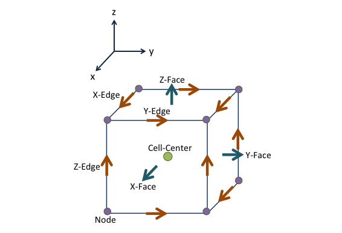

.. _api_FiniteVolume:

Finite Volume
*************

Any numerical implementation requires the discretization of continuous
functions into discrete approximations. These approximations are typically
organized in a mesh, which defines boundaries, locations, and connectivity. Of
specific interest to geophysical simulations, we require that averaging,
interpolation and differential operators be defined for any mesh. In SimPEG,
we have implemented a staggered mimetic finite volume approach (`Hyman and
Shashkov, 1999 <https://cnls.lanl.gov/~shashkov/papers/maxjcp.pdf>`_). This
approach requires the definitions of variables at either cell-centers, nodes,
faces, or edges as seen in the figure below.

.. toctree::
   :maxdepth: 2

   api_Mesh
   api_DiffOps
   api_InnerProducts
