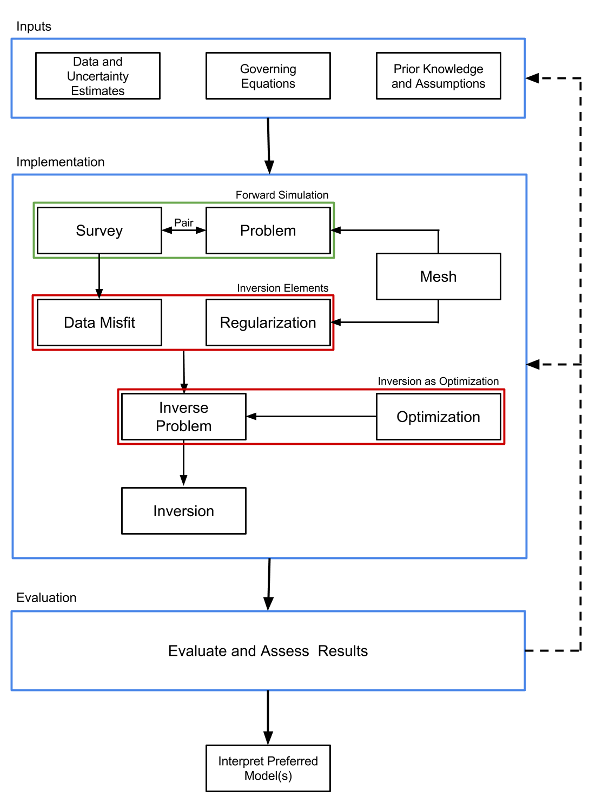

Why SimPEG?
===========

Our essential functions as researchers are the pursuit and dissemination of knowledge through research and education. As scientists we
seek to find models that reproduce the observations that we make in the world. In geophysics, we use inverse theory to mathematically
create models of the earth from measured data. It is a difficult problem with many moving pieces: physics, discretization, simulation,
regularization, optimization, computer science, linear algebra, geology. Exploring each of these disciplines can take a career, if you
are so inclined, but as geophysicists we care about the combination: how to pull these disciplines together to answer our questions.
This is the first problem we hope to help solve: to create a toolbox for the geophysicist that allows you to work at a high level and
keep your geophysical question in focus. However, a toolbox is not enough. The research questions that we are interested in surround
the integration of information to make better decisions.

We believe that the feedback loops in the geosciences could use some serious work. For example, collect multiple data-sets from the
same field area (geology, seismic, electromagnetics, hydrogeology), process the data separately, and then reconvene with your
multidisciplinary team. You may be rather surprised (or not) that the everyone has a (completely!?) different model. Dissonant at best,
but often conflicting in the details. Therein lies the second problem: how do we integrate these geoscience fields? Not by force or
even by default, but at least to have the option of quantitative communication and built in feedback loops. What we require is an
implementation that is inherently and unequivocally modular, with all pieces available to manipulation. Black-box software, where the
implementations are hidden, obfuscated, or difficult to manipulate, do not promote experimentation and investigation. We are working on
a framework that exposes the details of the implementation to the geophysicist in a manner that promotes productivity and question
based interrogation. This framework can be easily extended to encompass many geophysical problems and is built with the inverse problem
as the fundamental goal.

The future we see is a mix of tools that span our disciplines, and a framework that allows us to integrate many different types of
geophysical data so that we can communicate effectively and experiment efficiently. A toolbox combined with a framework that allows you
to solve your own problems, and creates opportunities for us to work together to better image and understand the subsurface. What we
are building is called SimPEG, simulation and parameter estimation in geophysics. We are building it in the open. We are testing it.
Breaking it. Building it. Fixing it. Using it. If you believe, like we do, that geophysics can be more innovative and informative in
the open and that these tools are necessary and invaluable in education as well as research, then you should get in touch. There is a
lot of work to do!

The Big Picture
---------------

Defining a well-posed inverse problem and solving it is a complex task that
requires many components that must interact. It is helpful to view this task
as a workflow in which various elements are explicitly identified and
integrated. The figure below outlines the inversion components that consists
of inputs, implementation, and evaluation. The inputs are composed of the
geophysical data, the equations which are a mathematical description of the
governing physics, and prior knowledge or assumptions about the setting. The
implementation consists of two broad categories: the forward simulation and
the inversion. The **forward simulation** is the means by which we solve the
governing equations given a model and the **inversion components** evaluate
and update this model. We are considering a gradient based approach, which
updates the model through an optimization routine. The output of this
implementation is a model, which, prior to interpretation, must be evaluated.
This requires considering, and often re-assessing, the choices and assumptions
made in both the input and implementation stages.

.. image:: ../../images/InversionWorkflow-PreSimPEG.png
   :width: 400 px
   :alt: Components
   :align: center

A Comprehensive Framework
-------------------------

There are an overwhelming amount of choices to be made as one works through
the forward modeling and inversion process (see figure above). As a result,
software implementations of this workflow often become complex and highly
interdependent, making it difficult to interact with and to ask other
scientists to pick up and change. Our approach to handling this complexity is
to propose a framework, (see below), that compartmentalizes the implementation
of inversions into various units. We present it in this specific modular
style, as each unit contains a targeted subset of choices crucial to the
inversion process.

The process of obtaining an acceptable model from an inversion generally
requires the geophysicist to perform several iterations of the inversion
workflow, rethinking and redesigning each piece of the framework to ensure it
is appropriate in the current context. Inversions are experimental and
empirical by nature and our software package is designed to facilitate this
iterative process. To accomplish this, we have divided the inversion
methodology into eight major components (See figure above). The
:class:`discretize.base.BaseMesh` class handles the discretization of the
earth and also provides numerical operators. The :class:`SimPEG.survey.BaseSurvey`
class handles the geometry of a geophysical problem as well as sources and
receivers. The :class:`SimPEG.simulation.BaseSimulation` class handles the
simulation of the physics for the geophysical problem of interest. The
:class:`SimPEG.simulation.BaseSimulation` creates geophysical fields given a
source from the :class:`SimPEG.survey.BaseSurvey`, interpolates these fields to
the receiver locations, and converts them to the appropriate data type, for
example, by selecting only the measured components of the field. Each of these
operations may have associated derivatives with respect to the model and the
computed field; these are included in the calculation of the sensitivity. For
the inversion, a :class:`SimPEG.data_misfit.BaseDataMisfit` is chosen to capture
the goodness of fit of the predicted data and a
:class:`SimPEG.regularization.BaseRegularization` is chosen to handle the non-
uniqueness. These inversion elements and an Optimization routine are combined
into an inverse problem class :class:`SimPEG.inverse_problem.BaseInvProblem`.
:class:`SimPEG.inverse_problem.BaseInvProblem` is the mathematical statement that
will be numerically solved by running an Inversion. The
:class:`SimPEG.inversion.BaseInversion` class handles organization and
dispatch of directives between all of the various pieces of the framework.

The arrows in the figure above indicate what each class takes as a primary
argument. For example, both the :class:`SimPEG.simulation.BaseSimulation` and
:class:`SimPEG.regularization.BaseRegularization` classes take a
:class:`discretize.base.BaseMesh` class as an argument. The diagram does
not show class inheritance, as each of the base classes outlined have many
subtypes that can be interchanged. The :class:`discretize.base.BaseMesh`
class, for example, could be a regular Cartesian mesh
:class:`discretize.TensorMesh` or a cylindrical coordinate mesh
:class:`discretize.CylMesh`, which have many properties in common. These
common features, such as both meshes being created from tensor products, can
be exploited through inheritance of base classes, and differences can be
expressed through subtype polymorphism. Please look at the documentation here
for more in-depth information.

.. include:: ../../../CITATION.rst

Authors
-------

.. include:: ../../../AUTHORS.rst

License
-------

.. include:: ../../../LICENSE
