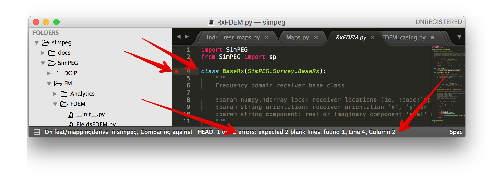

.. _practices:

Practices
=========

- **Purpose**: In the development of SimPEG, we strive to follow best practices. Here, we
  provide an overview of those practices and some tools we use to support them.

Here we cover

- testing_
- style_
- licensing_

.. _testing:

Testing
-------

.. image:: https://dev.azure.com/simpeg/simpeg/_apis/build/status/simpeg.simpeg?branchName=main
    :target: https://dev.azure.com/simpeg/simpeg/_build/latest?definitionId=2&branchName=main
    :alt: Azure pipeline

.. image:: https://codecov.io/gh/simpeg/simpeg/branch/main/graph/badge.svg
    :target: https://codecov.io/gh/simpeg/simpeg
    :alt: Coverage status

On each update, SimPEG is tested using the continuous integration service
`azure pipelines <https://azure.microsoft.com/en-us/products/devops/pipelines>`_.
We use `Codecov <http://codecov.io>`_ to check and provide stats on how much
of the code base is covered by tests. This tells which lines of code have been
run in the test suite. It does not tell you about the quality of the tests run!
In order to assess that, have a look at the tests we are running - they tell you
the assumptions that we do not want to break within the code base.

Within the repository, the tests are located in the top-level **tests**
directory. Tests are organized similar to the structure of the repository.
There are several types of tests we employ, this is not an exhaustive list,
but meant to provide a few places to look when you are developing and would
like to check that the code you wrote satisfies the assumptions you think it
should.

Testing is performed with :code:`pytest` which is available through PyPI.
Checkout the docs on `pytest <https://docs.pytest.org/>`_.

Compare with known values
^^^^^^^^^^^^^^^^^^^^^^^^^

In a simple case, you might know the exact value of what the output should be
and you can :code:`assert` that this is in fact the case. For example,
we setup a 3D :code:`BaseRectangularMesh` and assert that it has 3 dimensions.

.. code:: python

    from discretize.base import BaseRectangularMesh
    import numpy as np

    mesh = BaseRectangularMesh([6, 2, 3])

    def test_meshDimensions():
        assert mesh.dim == 3

All functions with the naming convention :code:`test_XXX`
are run. Here we check that the dimensions are correct for the 3D mesh.

If the value is not an integer, you can be subject to floating point errors,
so :code:`assert ==` might be too harsh. In this case, you will want to use
the ``numpy.testing`` module to check for approximate equals. For instance,

.. code:: python

    import numpy as np
    import discretize
    from SimPEG import maps

    def test_mapMultiplication(self):
        M = discretize.TensorMesh([2,3])
        expMap = maps.ExpMap(M)
        vertMap = maps.SurjectVertical1D(M)
        combo = expMap*vertMap
        m = np.arange(3.0)
        t_true = np.exp(np.r_[0,0,1,1,2,2.])
        np.testing.assert_allclose(combo * m, t_true)

These are rather simple examples, more advanced tests might include `solving an
electromagnetic problem numerically and comparing it to an analytical
solution <https://github.com/simpeg/simpeg/blob/main/tests/em/fdem/forward/test_FDEM_analytics.py>`_ , or
`performing an adjoint test <https://github.com/simpeg/simpeg/blob/main/tests/em/fdem/inverse/adjoint/test_FDEM_adjointEB.py>`_ to test :code:`Jvec` and :code:`Jtvec`.

.. _order_test:

Order and Derivative Tests
^^^^^^^^^^^^^^^^^^^^^^^^^^

Order tests can be used when you are testing differential operators (we are using a second-order,
staggered grid discretization for our operators). For example, testing a 2D
curl operator in `test_operators.py <https://github.com/simpeg/discretize/blob/main/tests/base/test_operators.py>`_

.. code:: python

    import numpy as np
    import unittest
    from discretize.tests import OrderTest

    class TestCurl2D(OrderTest):
        name = "Cell Grad 2D - Dirichlet"
        meshTypes = ['uniformTensorMesh']
        meshDimension = 2
        meshSizes = [8, 16, 32, 64]

        def getError(self):
            # Test function
            ex = lambda x, y: np.cos(y)
            ey = lambda x, y: np.cos(x)
            sol = lambda x, y: -np.sin(x)+np.sin(y)

            sol_curl2d = call2(sol, self.M.gridCC)
            Ec = cartE2(self.M, ex, ey)
            sol_ana = self.M.edge_curl*self.M.project_face_vector(Ec)
            err = np.linalg.norm((sol_curl2d-sol_ana), np.inf)

            return err

        def test_order(self):
            self.orderTest()

Derivative tests are a particular type or :ref:`order_test`, and since they
are used so extensively, SimPEG includes a :code:`check_derivative` method.

In the case
of testing a derivative, we consider a Taylor expansion of a function about
:math:`x`. For a small perturbation :math:`\Delta x`,

.. math::

    f(x + \Delta x) \simeq f(x) + J(x) \Delta x + \mathcal{O}(h^2)

As :math:`\Delta x` decreases, we expect :math:`\|f(x) - f(x + \Delta x)\|` to
have first order convergence (e.g. the improvement in the approximation is
directly related to how small :math:`\Delta x` is, while if we include the
first derivative in our approximation, we expect that :math:`\|f(x) +
J(x)\Delta x - f(x + \Delta x)\|` to converge at a second-order rate. For
example, all `maps have an associated derivative test <https://github.com/simpeg/simpeg/blob/main/SimPEG/maps.py#L127>`_ . An example from `test_FDEM_derivs.py <ht
tps://github.com/simpeg/simpeg/blob/main/tests/em/fdem/inverse/derivs/test_F
DEM_derivs.py>`_

.. code:: python

    def derivTest(fdemType, comp):

        # setup problem, survey

        def fun(x):
            return survey.dpred(x), lambda x: prb.Jvec(x0, x)
        return tests.check_derivative(fun, x0, num=2, plotIt=False, eps=FLR)

.. _documentation:

Documentation
-------------

Documentation helps others use your code! Please document new contributions.
SimPEG trys to follow the `numpydoc` style of docstrings, check out the
`style guide <https://numpydoc.readthedocs.io/en/latest/format.html>`_.
SimPEG then uses `sphinx <http://www.sphinx-doc.org/>`_ to build the documentation.
When documenting a new class or function, please include a description
(with math if it solves an equation), inputs, outputs and preferably a small example.

For example:

.. code:: python

    class WeightedLeastSquares(BaseComboRegularization):
        r"""Weighted least squares measure on model smallness and smoothness.

        L2 regularization with both smallness and smoothness (first order
        derivative) contributions.

        Parameters
        ----------
        mesh : discretize.base.BaseMesh
        active_cells : array_like of bool or int, optional
            List of active cell indices, or a `mesh.n_cells` boolean array
            describing active cells.
        alpha_s : float, optional
            Smallness weight
        alpha_x, alpha_y, alpha_z : float or None, optional
            First order smoothness weights for the respective dimensions.
            `None` implies setting these weights using the `length_scale`
            parameters.
        alpha_xx, alpha_yy, alpha_zz : float, optional
            Second order smoothness weights for the respective dimensions.
        length_scale_x, length_scale_y, length_scale_z : float, optional
            First order smoothness length scales for the respective dimensions.
        mapping : SimPEG.maps.IdentityMap, optional
            A mapping to apply to the model before regularization.
        reference_model : array_like, optional
        reference_model_in_smooth : bool, optional
            Whether to include the reference model in the smoothness terms.
        weights : None, array_like, or dict or array_like, optional
            User defined weights. It is recommended to interact with weights using
            the `get_weights`, `set_weights` functionality.

        Notes
        -----
        The function defined here approximates:

        .. math::
            \phi_m(\mathbf{m}) = \alpha_s \| W_s (\mathbf{m} - \mathbf{m_{ref}} ) \|^2
            + \alpha_x \| W_x \frac{\partial}{\partial x} (\mathbf{m} - \mathbf{m_{ref}} ) \|^2
            + \alpha_y \| W_y \frac{\partial}{\partial y} (\mathbf{m} - \mathbf{m_{ref}} ) \|^2
            + \alpha_z \| W_z \frac{\partial}{\partial z} (\mathbf{m} - \mathbf{m_{ref}} ) \|^2

        Note if the key word argument `reference_model_in_smooth` is False, then mref is not
        included in the smoothness contribution.

        If length scales are used to set the smoothness weights, alphas are respectively set internally using:
        >>> alpha_x = (length_scale_x * min(mesh.edge_lengths)) ** 2
        """

.. _style:

Style
-----

Consistency makes code more readable and easier for collaborators to jump in.
`PEP 8 <https://www.python.org/dev/peps/pep-0008/>`_ provides conventions for
coding in Python. SimPEG is currently not `PEP 8
<https://www.python.org/dev/peps/pep-0008/>`_ compliant, but we are working
towards it and would appreciate contributions that do too!

SimPEG uses `black <https://black.readthedocs.io/>`_ version 23.1.0 to autoformat
the code base, and all additions to the code are tested to ensure that they are
compliant with `black`. We recommend installing `pre-commit <https://pre-commit.com/>`_
hooks that are run on every commit to automatically ensure compliance.

We also actively update the code base to ensure pep8 compliance by checking with
`flake8 <https://flake8.pycqa.org/>`_ This performs style checks that could lead
towards bugs, performs checks on consistent documentation formatting, or just
identify poor coding practices. This is an ongoing process where we are fixing one
style warning at a time. The fixed style warnings are checked to ensure no new code
goes against an already established style. This test can also be installed locally
using pre-commit hooks, similar to `black` above.

If you have sublime text 3, the linter can be set up through sublime text 3's package manager. The step by
step process is found :ref:`here <api_practices_linter_install>`. Other IDE's
will also generally warn the user on on pep8 compliance.

Sublime has PEP 8 linter packages that you can use. I use `SublimeLinter-pep8 <https://github.com/SublimeLinter/SublimeLinter-pep8>`_.
You can install it by going to your package manager (`cmd + shift + p`),
install package and search for SublimeLinter-pep8. Installation instructions are available at https://github.com/SublimeLinter/SublimeLinter-pep8.

This highlights and gives you tips on how to correct the code.

Below is a sample user-settings configuration for the SublimeLinter (Sublime
Text > Preferences > Package Settings > SublimeLinter > Settings-User)

.. code:: json

    {
        "user": {
            "debug": false,
            "delay": 0.25,
            "error_color": "D02000",
            "gutter_theme": "Packages/SublimeLinter/gutter-themes/Default/Default.gutter-theme",
            "gutter_theme_excludes": [],
            "lint_mode": "background",
            "linters": {
                "pep8": {
                    "@disable": false,
                    "args": [],
                    "excludes": [],
                    "ignore": "",
                    "max-line-length": null,
                    "select": ""
                },
                "proselint": {
                    "@disable": false,
                    "args": [],
                    "excludes": []
                }
            },
            "mark_style": "solid underline",
            "no_column_highlights_line": false,
            "passive_warnings": false,
            "paths": {
                "linux": [],
                "osx": [
                    "/anaconda/bin"
                ],
                "windows": []
            },
            "python_paths": {
                "linux": [],
                "osx": [],
                "windows": []
            },
            "rc_search_limit": 3,
            "shell_timeout": 10,
            "show_errors_on_save": false,
            "show_marks_in_minimap": true,
            "syntax_map": {
                "html (django)": "html",
                "html (rails)": "html",
                "html 5": "html",
                "javascript (babel)": "javascript",
                "magicpython": "python",
                "php": "html",
                "python django": "python",
                "pythonimproved": "python"
            },
            "warning_color": "DDB700",
            "wrap_find": true
        }
    }

Install PEP8 Linter Through Sublime Text 3
^^^^^^^^^^^^^^^^^^^^^^^^^^^^^^^^^^^^^^^^^^

.. _api_practices_linter_install:

Instructions for installing and activating the pep8 linter for Mac OS X/Linux/Windows are below. For this to work, you MUST have installed sublime text 3.

**Step 1: Install Sublime Linter 3:**

- Open sublime text 3
- Open the Command Palette (cmd+shift+p on Mac OS X, ctrl+shift+p on Linux/Windows).
- Type 'install' and select 'Package Control: Install Package' from the Command Palette. There will be a pause of a few seconds while Package Control finds the available packages.
- When the list of available packages appears, type 'linter' and select 'SublimeLinter'. Note: The github repository name is “SublimeLinter3”, but the plugin name remains “SublimeLinter”.
- After a few seconds SublimeLinter will be installed and loaded. Depending on your setup, you may see some prompts from SublimeLinter. For more information on SublimeLinter’s startup actions, see Startup actions. You will see an install message.
- After reading the message, close Sublime Text 3

**Step 2: Install pep8 Linter:**

- Open sublime text 3
- Open the Command Palette (cmd+shift+p on Mac OS X, ctrl+shift+p on Linux/Windows).
- Type 'install' and select 'Package Control: Install Package' from the Command Palette. There will be a pause of a few seconds while Package Control finds the available packages.
- When the list of available packages appears, type 'pep8' and select the appropriate option.
- After a few seconds pep8 linter will be installed and loaded. Depending on your setup, you may see some prompts from SublimeLinter. For more information on SublimeLinter’s startup actions, see Startup actions. You will see an install message.
- After reading the message, close Sublime Text 3

The next time you open a .py file in sublime text 3, the linter should be activated.

.. _licensing:

Licensing
---------

.. image:: https://img.shields.io/badge/license-MIT-blue.svg
    :target: https://github.com/simpeg/simpeg/blob/main/LICENSE
    :alt: MIT license

We want SimPEG to be a useful resource for the geoscience community and
believe that following open development practices is the best way to do that.
SimPEG is licensed under the `MIT license
<https://github.com/simpeg/simpeg/blob/main/LICENSE>`_ which is allows open
and commercial use and extension of SimPEG. It does not force packages that
use SimPEG to be open source nor does it restrict commercial use.
