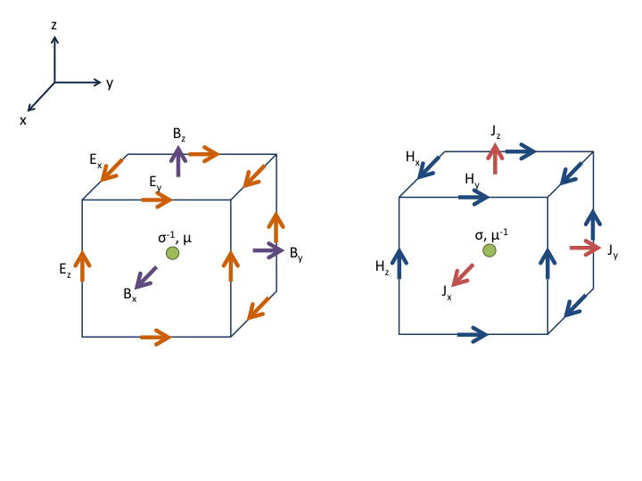

.. _api_FDEM:

.. math::
    \renewcommand{\div}{\nabla\cdot\,}
    \newcommand{\grad}{\vec \nabla}
    \newcommand{\curl}{{\vec \nabla}\times\,}

Frequency Domain Electromagnetics
*********************************

Electromagnetic (EM) geophysical methods are used in a variety of applications
from resource exploration, including for hydrocarbons and minerals, to
environmental applications, such as groundwater monitoring. The primary
physical property of interest in EM is electrical conductivity, which
describes the ease with which electric current flows through a material.

Background
==========

Electromagnetic phenomena are governed by Maxwell's equations. They describe
the behavior of EM fields and fluxes. Electromagnetic theory for geophysical
applications by Ward and Hohmann (1988) is a highly recommended resource on
this topic.

Fourier Transform Convention
----------------------------

In order to examine Maxwell's equations in the frequency domain, we must first
define our choice of harmonic time-dependence by choosing a Fourier transform
convention. We use the :math:`e^{i \omega t}` convention, so we define our
Fourier Transform pair as

.. math ::
    F(\omega) = \int_{-\infty}^{\infty} f(t) e^{- i \omega t} dt \\

    f(t) = \frac{1}{2\pi}\int_{-\infty}^{\infty} F(\omega) e^{i \omega t} d \omega

where :math:`\omega` is angular frequency, :math:`t` is time, :math:`F(\omega)` is the function defined in the frequency domain and :math:`f(t)` is the function defined in the time domain.

Maxwell's Equations
===================

In the frequency domain, Maxwell's equations are given by

.. math ::
    \curl \vec{E} + i \omega \vec{B} = \vec{S_m}\\

    \curl \vec{H} - \vec{J} - i \omega \vec{D} = \vec{S_e} \\

    \div \vec{B} = 0 \\

    \div \vec{D} = \rho_f

where:

    - :math:`\vec{E}`   : electric field (:math:`V/m` )
    - :math:`\vec{H}`   : magnetic field (:math:`A/m` )
    - :math:`\vec{B}`   : magnetic flux density (:math:`Wb/m^2` )
    - :math:`\vec{D}`   : electric displacement / electric flux density (:math:`C/m^2` )
    - :math:`\vec{J}`   : electric current density (:math:`A/m^2` )
    - :math:`\vec{S_m}` : magnetic source term (:math:`V/m^2` )
    - :math:`\vec{S_e}` : electric source term (:math:`A/m^2` )
    - :math:`\rho_f`   : free charge density (:math:`\Omega m` )

Constitutive Relations
----------------------

The fields and fluxes are related through the constitutive relations. At each frequency, they are given by

.. math ::
    \vec{J} = \sigma \vec{E} \\

    \vec{B} = \mu \vec{H} \\

    \vec{D} = \varepsilon \vec{E}

where:

- :math:`\sigma` : electrical conductivity (:math:`S/m`)
- :math:`\mu` : magnetic permeability (:math:`H/m`)
- :math:`\varepsilon` : dielectric permittivity (:math:`F/m`)

:math:`\sigma`, :math:`\mu`, :math:`\varepsilon` are physical properties which depend on the material. :math:`\sigma` describes how easily electric current passes through a material, :math:`\mu` describes how easily a material is magnetized, and :math:`\varepsilon` describes how easily a material is electrically polarized. In most low-frequency geophysical applications of EM, :math:`\sigma` is the primary physical property of interest, and :math:`\mu`, :math:`\varepsilon` are assumed to have their free-space values :math:`\mu_0 = 4\pi \times 10^{-7} H/m` , :math:`\varepsilon_0 = 1/(\mu_0 c^2) \approx 8.85 \times 10^{-12} F/m`, where :math:`c` is the speed of light in free space.

Quasi-static Approximation
--------------------------

For the frequency range typical of most geophysical surveys, the contribution of the electric displacement is negligible compared to the electric current density. In this case, we use the quasi-static approximation and assume that this term can be neglected, giving

.. math ::
    \nabla \times \vec{E} + i \omega \vec{B} = \vec{S_m} \\
    \nabla \times \vec{H} - \vec{J} = \vec{S_e}

Geophysical methods where the quasi-static approximation, often called diffusive approximation, does not hold are high-frequency methods such as ground-penetrating radar or dielectric well-log measurements.

Implementation in SimPEG.electromagnetics
=========================================

We consider two formulations in SimPEG.electromagnetics, both first-order and both in terms of one field and one flux. We allow for the definition of magnetic and electric sources (see for example: Ward and Hohmann, starting on page 144). The E-B formulation is in terms of the electric field and the magnetic flux:

.. math ::
    \nabla \times \vec{E} + i \omega \vec{B} = \vec{S}_m \\
    \nabla \times \mu^{-1} \vec{B} - \sigma \vec{E} = \vec{S}_e

The H-J formulation is in terms of the current density and the magnetic field:

.. math ::
    \nabla \times \sigma^{-1} \vec{J} + i \omega \mu \vec{H} = \vec{S}_m \\
    \nabla \times \vec{H} - \vec{J} = \vec{S}_e

Discretizing
------------

For both formulations, we use a finite volume discretization
and discretize fields on cell edges, fluxes on cell faces and
physical properties in cell centers. This is particularly
important when using symmetry to reduce the dimensionality of a problem
(for instance on a 2D CylMesh, there are :math:`r`, :math:`z` faces and :math:`\theta` edges)

.. figure:: ../../images/finitevolrealestate.png
    :align: center
    :scale: 60 %

For the two formulations, the discretization of the physical properties, fields and fluxes are summarized below.

Note that resistivity is the inverse of conductivity, :math:`\rho = \sigma^{-1}`.

E-B Formulation
---------------

.. math ::
    \mathbf{C} \mathbf{e} + i \omega \mathbf{b} = \mathbf{s_m} \\
    \mathbf{C^T} \mathbf{M^f_{\mu^{-1}}} \mathbf{b} - \mathbf{M^e_\sigma} \mathbf{e} = \mathbf{M^e} \mathbf{s_e}

H-J Formulation
---------------

.. math ::
    \mathbf{C^T} \mathbf{M^f_\rho} \mathbf{j} + i \omega \mathbf{M^e_\mu} \mathbf{h} = \mathbf{M^e} \mathbf{s_m} \\
    \mathbf{C} \mathbf{h} - \mathbf{j} = \mathbf{s_e}

.. Forward Problem
.. ===============

.. Inverse Problem
.. ===============

API
===

FDEM Problem
------------

.. automodule:: SimPEG.electromagnetics.frequency_domain.simulation
    :show-inheritance:
    :members:
    :undoc-members:

FDEM Survey
-----------

.. automodule:: SimPEG.electromagnetics.frequency_domain.survey
    :show-inheritance:
    :members:
    :undoc-members:

.. automodule:: SimPEG.electromagnetics.frequency_domain.sources
    :show-inheritance:
    :members:
    :undoc-members:

.. automodule:: SimPEG.electromagnetics.frequency_domain.receivers
    :show-inheritance:
    :members:
    :undoc-members:

FDEM Fields
-----------

.. automodule:: SimPEG.electromagnetics.frequency_domain.fields
    :show-inheritance:
    :members:
    :undoc-members:
