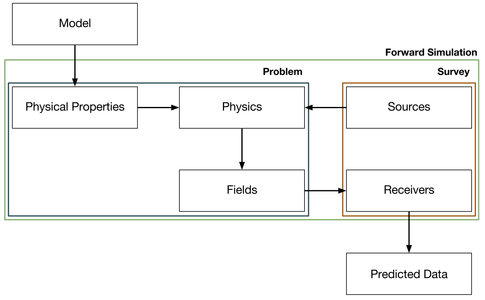

Electromagnetics
================

`SimPEG.electromagnetics` uses SimPEG as the framework for the forward and inverse
electromagnetics geophysical problems.

To solve for predicted data, we follow the framework shown below. The model is
what we invert for. This is mapped to a physical property on the simulation
mesh. A source which is used to excite the system is specified. Having a model
and a source, we can solve Maxwell's equations for fields. We sample these
fields with receivers to give us predicted data.

.. toctree::
   :maxdepth: 2

   api_basic
   api_FDEM
   api_TDEM
   api_NSEM
   api_Utils
