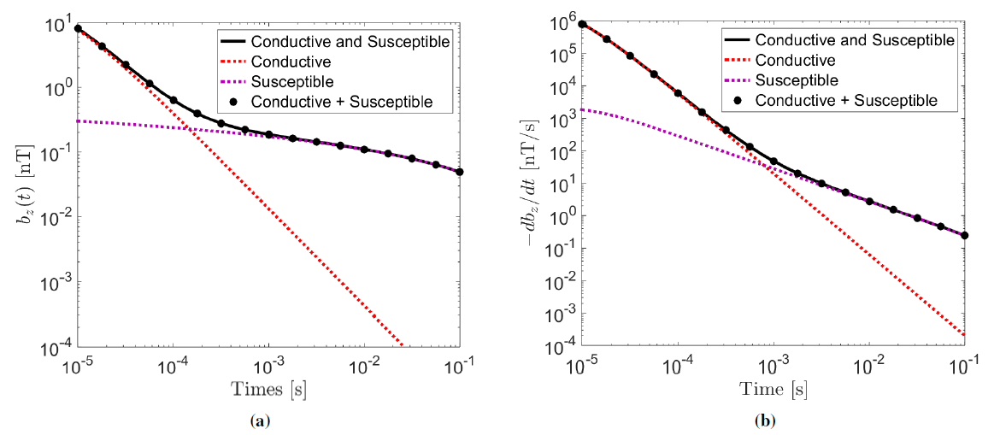
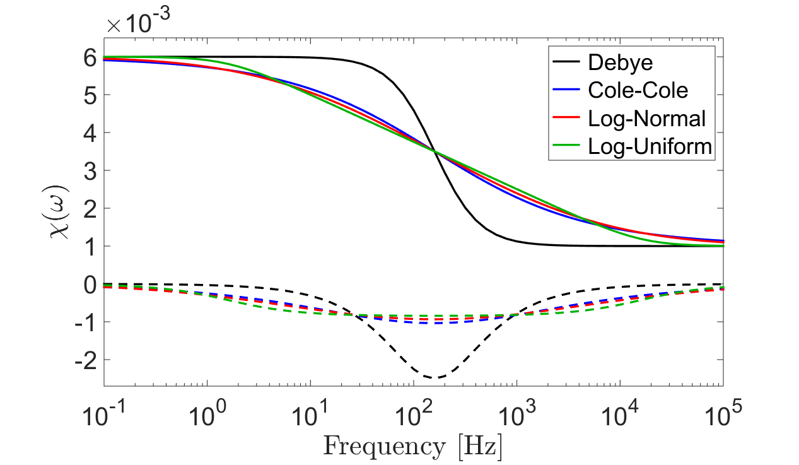
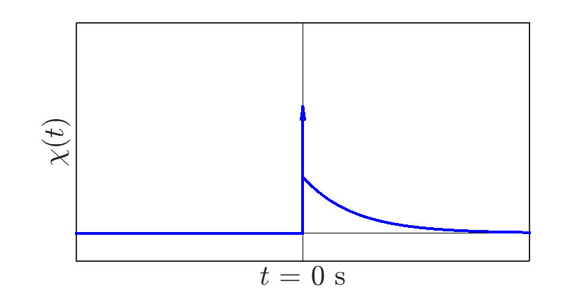

Background Theory
=================

**The background theory presented here is copied entirely from the Master's thesis "Forward modeling and inversion of viscous remanent magnetization responses in the time domain" (Cowan, 2016). See this thesis for a more thorough treatment of the background theory.**

General
-------

To first order, and during the off-time, the Earth’s inductive and viscous remanent magnetization (VRM) responses are separable so long as the Earth’s magnetic susceptibility
is sufficiently small (Druyts et al., 2009); i.e. :math:`\chi < 0.1`. This was first postulated by Buselli (1982);
who used various SiroTEM configurations to perform field experiments. The approximation was later validated
numerically by Pasion (2007), among others. At early times, the response is equivalent to that of a purely conductive
Earth (red); at late times, the response is equivalent to that of a purely viscous Earth (purple). By summing
the responses from these two models, the response from a conductive and magnetically viscous Earth can be approximated. Thus:

.. math::
	\vec{b}(t) = \vec{b}_{em}(t) + \vec{b}_{vrm}(t)

    Vertical step-off response from a horizontal circular current loop over a conductive and magnetically viscous halfspace. (a) :math:`b_z`. (b) :math:`\partial b_z/\partial t`.

Here, we develop a methodology for modeling :math:`\mathbf{b_{vrm}}`; as methodologies currently exist for modeling :math:`\mathbf{b_{em}}`. According
to Blakely (1996), the anomalous magnetic response :math:`\vec{b} (P ,t)` at location :math:`P` outside of a magnetized region is given by the following integral equation:

.. math::
	\vec{b}(P,t) = \frac{\mu_0}{4\pi} \int_{V} \nabla \nabla \frac{1}{r} \cdot \vec{M} (Q , t) dV
	:name: vrm_blakely

where :math:`\vec{M} (Q,t)` is the magnetization at locations :math:`Q` within the source region :math:`V` and :math:`r` is given by:

.. math::
	r = \sqrt{\big ( x_P - x_Q \big )^2 + \big ( y_P - y_Q \big )^2 + \big ( z_P - z_Q \big )^2 }

SimPEG methods for modeling VRM responses in the time-domain are numerical solutions to the above equation.

Dispersive Magnetic Susceptibility
----------------------------------

Magnetic susceptibility defines the degree of induced magnetization experienced by a material, proportional to the strength of an applied magnetic field. In magnetically viscous rocks/soils, the induced magnetization depends on the frequency of the applied field (Lee, 1984; Dabas et al., 1992; Fannin and Charles, 1995; Meglich et al., 2008), thus:

.. math::
	\vec{M} (\omega )= \chi (\omega) \vec{H}_0 (\omega)

where :math:`\vec M` is the magnetization, :math:`\vec{H}_0` is the applied magnetic field and :math:`\chi` is a frequency-dependent magnetic susceptibility. Commonly used models for the frequency-dependent magnetic susceptibility are derived by applying a weighting function :math:`f(\tau )` and integrating over all Debye models:

.. math::
	\chi (\omega) = \chi_\infty + \Delta \chi \int_0^\infty \frac{f (\tau )}{1 +i \omega\tau} d\tau

where :math:`\tau` is the time-relaxation constant, :math:`\chi_\infty` is the instantaneous magnetic susceptibility and :math:`\Delta \chi` is the DC contribution due to magnetic viscosity. 

    Frequency-dependent magnetic susceptibility assuming various distributions of time-relaxation constants.

As we can see, the magnetic viscosity is defined by the choice in weighting function. The majority of soil samples can be adequately fit by assuming a log-uniform distribution of time relaxation constants between
a set of finite limits :math:`\tau_1` and :math:`\tau_2` (Dabas et al., 1992; Worm, 1998; Igel et al., 2012). This leads to a magnetic susceptibility of the form:

.. math::
	\chi (\omega) = \chi_\infty + \Delta \chi \Bigg [ 1 - \frac{1}{\textrm{ln} (\tau_2 / \tau_1) } \textrm{ln} \Bigg ( \frac{1 + i\omega\tau_2}{1 + i\omega\tau_1} \Bigg ) \Bigg ]

In the time-domain, the relationship between the applied magnetic field and the resulting magnetization becomes a convolution:

.. math::
	\vec{M}(t) = \chi (t) \otimes \vec{h}_0 (t) = \int_{-\infty}^\infty \chi (\xi) \vec{h}_0 (t - \xi) d\xi
	:name: vrm_magnetization

where :math:`\vec M (t)` is the induced magnetization, :math:`\vec{h}_0 (t)` is the applied magnetic field, and :math:`\chi (t)` represents the magnetization’s impulse response. For a log-uniform distribution of time-relaxation constants, this is given by:

.. math::
	\begin{align}
	\chi (t) & = \chi_\infty \delta (t) + \Delta \chi \, u(t) \int_0^\infty f(\tau) \frac{e^{-t/\!\tau}}{\tau} d\tau \\
	& = \chi_\infty \delta (t) + \frac{\Delta \chi}{\textrm{ln} (\tau_2 / \tau_2)} \Bigg [ \frac{e^{-t/\!\tau_2} - e^{-t/\!\tau_2}}{t} \Bigg ] \, u(t)
	\end{align}
	:name: vrm_impulse

where :math:`u(t)` is the unit step function and :math:`\delta (t)` is the Dirac delta function. In the previous equation, the first term characterizes instantaneous magnetization and the second term characterizes magnetic viscosity.

    General shape of the impulse response.

Numerical Solution
------------------

The anomalous magnetic response outside of a magnetized region is given by Eq. :eq:`vrm_blakely`. Assuming the magnetic response is the result of a set of uniformly magnetized rectangular cells, Eq. :eq:`vrm_blakely` is approximated by the following (Bhattacharyya, 1964; Varga, 1996):

.. math::
	\vec{b} (P , t) = \sum_{k=1}^K G^k \cdot \vec{M}^k (t)
	:name: vrm_varga

where :math:`\vec{b} (P , t)` is the time-dependent magnetization observed at :math:`P`, :math:`\vec{M} (t)` contains the vector components of induced magnetization within each cell :math:`k` at time :math:`t` and :math:`G` are :math:`3 \times 3` tensors representing a linear operator between the magnetization of the cell :math:`k` and the anomalous magnetic response at location :math:`P`. Thus :math:`\vec{b} (P , t)`, :math:`G` and :math:`\vec{M} (t)` are given by:

.. math::
	\vec{b} (P , t) = \begin{bmatrix} b_x (P,t) \\ b_y (P,t) \\ b_z (P,t) \end{bmatrix} \;\; , \;\;
	\vec{M} (t) = \begin{bmatrix} M_x (t) \\ M_y (t) \\ M_z (t) \end{bmatrix} \;\; \textrm{and} \;\;
	G = \begin{bmatrix} g_{xx} & g_{xy} & g_{xz} \\ g_{yx} & g_{yy} & g_{yz} \\ g_{zx} & g_{zy} & g_{zz} \end{bmatrix}

Eq. :eq:`vrm_varga` can be re-expressed as a linear system. And in the case that there are multiple observation locations, this system may be augmented and expressed as:

.. math::
	\mathbf{b}(t) = \mathbf{G} \, \vec{\mathbf{M}}(t)
	:name: vrm_system

where :math:`\mathbf{b}(t)`, :math:`\vec{\mathbf{M}}(t)` and :math:`\mathbf{G}` take the form:

.. math::
	\mathbf{b}(t) = \begin{bmatrix} \mathbf{b_x}(t) \\ \mathbf{b_y}(t) \\ \mathbf{b_z}(t) \end{bmatrix} \;\; , \;\;
	\vec{\mathbf{M}} (t) = \begin{bmatrix} \mathbf{M_x}(t) \\ \mathbf{M_y}(t) \\ \mathbf{M_z}(t) \end{bmatrix} \;\; \textrm{and} \;\;
	\mathbf{G} = \begin{bmatrix} G_{xx} & G_{xy} & G_{xz} \\ G_{yx} & G_{yy} & G_{yz} \\ G_{zx} & G_{zy} & G_{zz} \end{bmatrix}

Thus :math:`\mathbf{b}(t)` contains the cartesian components of the magnetic response at all observation locations, :math:`\vec{\mathbf{M}}(t)` contains the cartesian components of induced magnetization within all of the cells at time :math:`t` and :math:`\mathbf{G}` is a linear operator. The time-derivative of the response is given by:

.. math::
	\frac{\partial  \mathbf{b}}{\partial t} = \mathbf{G} \, \frac{\partial \vec{\mathbf{M}} }{\partial t}

The magnetization experienced by each cell :math:`k` is given by the following convolution:

.. math::
	\vec{M}^k (t) \approx \chi^k (t) \otimes \vec{h}_0^k (t)
	:name: vrm_mag_conv_cell 

where :math:`\vec{h}_0^k (t)` is the free-space field at the center cell :math:`k` due to an inductive source and :math:`\chi^k (t)` is the impulse response for cell :math:`k`. Here we assume 2 things:

	1. That the inducing field is approximately homogeneous throughout the cell
	2. That because we are modeling a purely viscous Earth, attenuation of the primary and secondary signal are negligible

Linear Problem
^^^^^^^^^^^^^^

The linear formulation allows for rapid computation of VRM responses during the off-time; see Cowan, (2016). Assuming the distribution of time-relaxation constants is sufficiently broad for a log-uniform distribution (i.e. :math:`\tau_1 \ll t \ll \tau_2`), then the off-time VRM experienced by each cell is given by:

.. math::
	\vec{M}^k (t) \approx m^k \, \vec{h}_{max}^k \, \eta (t)
	:name: vrm_off_time

where :math:`\vec{h}_{max}^k` is the inducing field at its maximum amplitude, :math:`\eta (t)` is a purely time-dependent function which defines the decay for any cell and :math:`m` is an indirect measure of magnetic viscosity and is related to :math:`\Delta \chi`, :math:`\tau_1` and :math:`\tau_2` by:

.. math::
	m = \frac{\Delta \chi}{ \textrm{ln} (\tau_2 / \tau_1)}

Using Eq. :eq:`vrm_off_time`, :math:`\vec{\mathbf{M}}(t)` in Eq. :eq:`vrm_system` becomes:

.. math::
	\vec{\mathbf{M}}(t) = \eta (t) \, \mathbf{H_0 \, m}
	:name: vrm_mag_lin

where :math:`\mathbf{H_0}` is a sparse matrix containing the cartesian components of :math:`\vec{h}_{max}^k` for every cell and :math:`\mathbf{m}` contains the parameter :math:`m^k` for every cell. Substituting Eq. :eq:`vrm_mag_lin` into Eq. :eq:`vrm_system`:

.. math::
	\begin{align}
	\mathbf{b}(t) &= \eta (t) \mathbf{G \, H_0 \, m} \\
	& = \eta (t) \mathbf{A \, m}
	\end{align}

where :math:`\mathbf{A}` is a dense linear operator containing the geometric sensitivity and

.. math::
	\frac{\partial \mathbf{b}}{\partial t} = \frac{d \eta}{dt} \mathbf{A \, m}

In the case that the predicted data vector :math:`\mathbb{F} [\mathbf{m}]` contains field observations at multiple times and locations, :math:`\eta` evaluated at different times can be used to construct a sparse matrix :math:`\mathbf{T}` such that:

.. math::
	\mathbb{F} [\mathbf{m}] = \mathbf{T \, A \, m}
	:name: vrm_fwd_lin

Although this problem is linear, storing the product of :math:`\mathbf{T}` and :math:`\mathbf{A}` can become prohibitively large as the number of observation times increases. As a result, the two operators are stored separately and matrix-vector products are taken as needed.

The Jacobian is given by:

.. math::
	\mathbf{J} = \mathbf{T \, A}

however it is never stored explicitly. Instead, optimization approach need only compute the output of :math:`\mathbf{Ju}` and :math:`\mathbf{J^T v}` where :math:`\mathbf{u}` and :math:`\mathbf{v}` are vectors.

Log-Uniform Problem
^^^^^^^^^^^^^^^^^^^

The general forward problem is non-linear, as the VRM does not decay in the same fashion within all cells. In this case however, we are not limited to computing the magnetic response during the off-time. The magnetization experienced by each cells is given by Eq. :eq:`vrm_mag_conv_cell`. However since the geometric and time-dependent terms are separable, this can be re-expressed as:

.. math::
	\vec{M}^k (t) = \vec{h}_{max}^k \, \zeta^k
	:name: vrm_all_time

where :math:`\vec{h}_{max}^k` is the inducing field at its maximum amplitude and :math:`\zeta^k` is the impulse response convolved with the normalized source waveform; :math:`\zeta` depends on :math:`t` and the values of :math:`\chi_\infty, \Delta \chi, \tau_1` and :math:`\tau_2` for each cell. Using Eq. :eq:`vrm_all_time`, :math:`\vec{\mathbf{M}}(t)` in Eq. :eq:`vrm_system` becomes:

.. math::
	\vec{\mathbf{M}}(t) = \mathbf{H_0 \,} \boldsymbol{ \zeta}(t)
	:name: vrm_mag_nonlin

where :math:`\mathbf{H_0}` is a sparse matrix containing the cartesian components of :math:`\vec{h}_{max}^k` for every cell and :math:`\boldsymbol{\zeta}(t)` contains the results of a convolution for every cell at time :math:`t`. Substituting Eq. :eq:`vrm_mag_nonlin` into Eq. :eq:`vrm_system`:

.. math::
	\begin{align}
	\mathbf{b}(t) &= \mathbf{G \, H_0 \,} \boldsymbol{\zeta} (t) \\
	& = \mathbf{A \,} \boldsymbol{\zeta} (t)
	\end{align}

where :math:`\mathbf{A}` is a dense linear operator containing the geometric sensitivity and

.. math::
	\frac{\partial \mathbf{b}}{\partial t} = \mathbf{A \,} \frac{\partial \boldsymbol{\zeta}}{\partial t}

Because the problem is non-linear with respect to parameters :math:`\chi_\infty, \Delta \chi, \tau_1` and :math:`\tau_2`, the predicted data vector :math:`\mathbb{F}[\mathbf{m}]` must be computed using a for loop if the number of observation times is larger than 1.

Sensitivity Refinement
^^^^^^^^^^^^^^^^^^^^^^

The formulation described here assumes that the inducing field is approximately homogeneous within each cell. In the case where cells are located in close proximity to an inductive source, this condition is violated. To remedy the issue, a geometric sensitivity refinement algorithm was developed. The algorithm locates cells within a certain distance of the source, recomputes the sensitivities assuming the cell is defined by :math:`2^{3n}` smaller cells, then replaces the appropriate columns in :math:`\mathbf{A}`. For further reading, see Cowan (2016)

